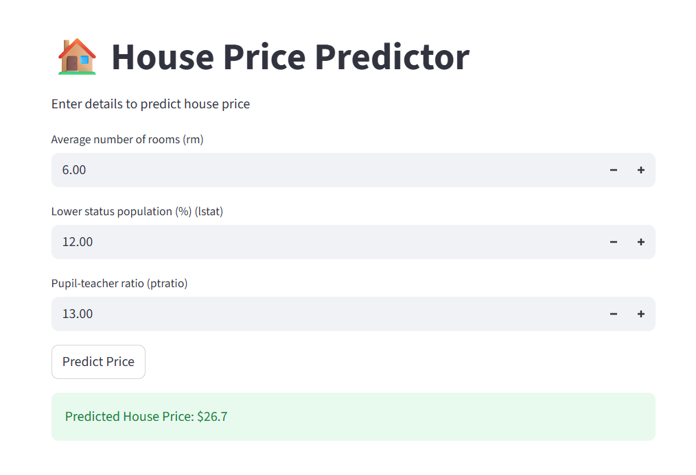

# 🏠 House Price Predictor

This project is a Machine Learning-based web application that predicts house prices using key housing features.

---

## 🚀 Features

* Predicts house prices using Linear Regression
* Simple and interactive UI built with Streamlit
* Instant prediction based on user input
* Uses a real-world housing dataset

---

## 🧠 How It Works

1. User enters:

   * Number of rooms (rm)
   * Lower income population percentage (lstat)
   * Pupil-teacher ratio (ptratio)
2. Input data is processed
3. Trained Linear Regression model predicts house price
4. Result is displayed instantly

---

## 🛠️ Technologies Used

* Python
* Pandas
* Scikit-learn
* Streamlit

---

## ▶️ Run Locally

```bash
streamlit run app.py
```

---

## 📸 Screenshot



---

## 📁 Project Structure

```
house-price-predictor/
│
├── app.py
├── model.py
├── predict.py
├── housing.csv
├── model.pkl
├── requirements.txt
├── README.md
├── app_screenshot.png
```

---

## 🧾 Conclusion

This project demonstrates how machine learning can be used to predict house prices using regression techniques with a simple and user-friendly interface.
